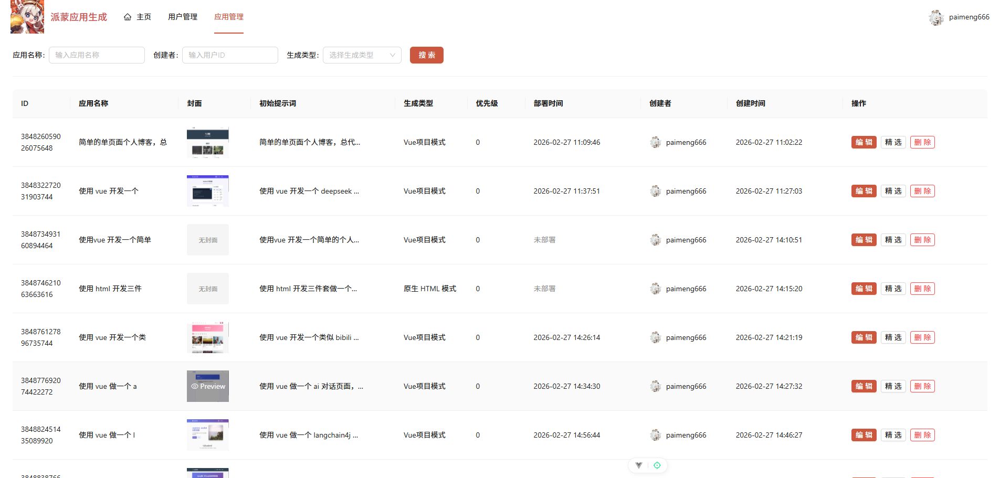

# 派蒙 AI 应用工坊

一个基于AI的代码生成平台，提供可视化的代码开发和管理功能。项目目前是单体项目，后续将重构为分布式架构，重构的代码将放在[paimeng-ai-code-mother-microservice](paimeng-ai-code-mother-microservice)包中。

## 项目运行效果

### 主页面展示

### AI 代码生成页面

### 可视化编辑效果

### 精选应用

### 项目部署

项目部署后可以直接访问：

### 应用后台管理

## 技术栈

### 前端技术栈

- **Vue 3**：渐进式JavaScript框架
- **TypeScript**：类型安全的JavaScript超集
- **Vite**：下一代前端构建工具
- **Ant Design Vue**：企业级UI组件库
- **Pinia**：Vue官方状态管理库
- **Vue Router**：Vue官方路由管理器
- **Axios**：HTTP客户端

### 后端技术栈

- **Spring Boot 3**：Spring 应用快速构建框架
- **LangChain4j**：AI 应用开发框架
- **LangGraph4j**：AI 工作流框架
- **MyBatis Flex**：ORM框架
- **MySQL**：关系型数据库
- **Redis**：缓存数据库
- **Nginx**：快速部署应用
- **Selenium**：浏览器操作框架
- **webdrivermanager**：浏览器驱动自动化管理框架，

## 开发规范

### 前端规范

- 使用 TypeScript 进行类型检查
- 遵循 Vue 3 Composition API 风格
- 使用 ESLint 进行代码质量检查
- 使用 Prettier 进行代码格式化

### 后端规范

- 遵循阿里巴巴Java开发手册
- 使用 MyBatis Flex 进行数据库操作
- 统一返回结果格式
- 全局异常处理
